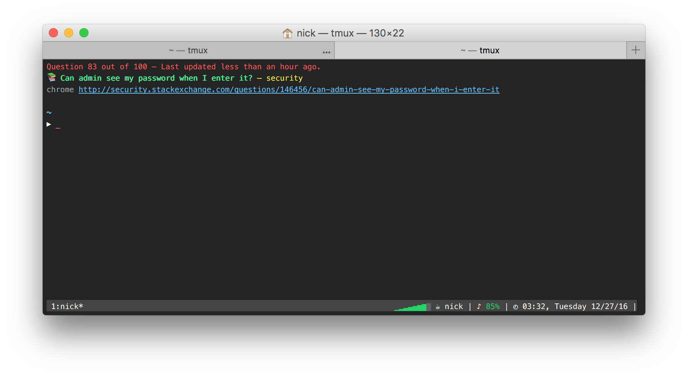

<center>
	
</center>

# Stack Exchange Hot Questions Console Prompt

This is just a simple script that will print a random question from the [Stack Exchange](http://stackexchange.com/) daily Hot Questions in your terminal. Simply set up your `.bash_profile`, `.bashrc`, `.zshrc`, or whatever you kids are using these days.

## How to Set Up

First, clone and set up this repository to your local machine:

```
$ git clone git@github.com:nickzuber/stackexchange-console-prompt.git
$ yarn install
```

Then, set this script up to run whenever you open a new terminal session:

```bash

# Execute the repository from where ever you cloned it
# In this example, the repository lives on the root
node ~/prompt

```

And that's it! Now every time your terminal window opens, you should receive a good ol' fashion community q.

## How Does This Work?

This is done with a quick 'n simple scrape of the 100 hot questions from the Stack Exchange home page. To enhance performance and avoid abusing bandwidth, the questions are only gathered once daily and are then stored in a local file. This file will update the next time a question is requested, and given that we haven't updated the question list in over 24 hours. 

## License

[MIT](https://opensource.org/licenses/MIT)<br />
Copyright (c) 2015 Nick Zuber

